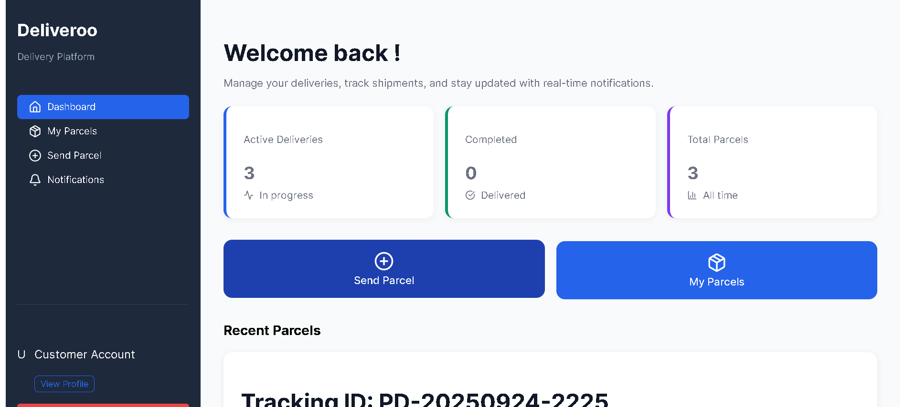

# Deliveroo– Parcel Management App

A full-stack parcel management application with **admin and customer roles**, JWT authentication, refresh token support, and a responsive React frontend.

---

## Table of Contents

- [Features](#features)
- [Tech Stack](#tech-stack)
- [Getting Started](#getting-started)
- [Environment Variables](#environment-variables)
- [Backend API](#backend-api)
- [Frontend](#frontend)
- [Authentication Flow](#authentication-flow)
- [Folder Structure](#folder-structure)
- [Tips & Troubleshooting](#tips--troubleshooting)
- [License](#license)

---

## Features

- User authentication: signup, login, logout
- JWT access tokens with automatic refresh using refresh tokens
- Role-based protected routes for **Admin** and **Customer**
- Admin dashboard: manage parcels, notifications, and parcel details
- Customer dashboard: view parcels, create parcels, update profile
- Forgot password and reset password via security questions
- Axios interceptors for automatic token refresh
- Responsive and user-friendly UI

---

## Tech Stack

- **Backend**: Flask, Flask-JWT-Extended, SQLAlchemy, Marshmallow, SQLite
- **Frontend**: React, Redux Toolkit, React Router, Axios
- **Authentication**: JWT access & refresh tokens
- **Deployment**: Render (backend), Netlify/Vercel (frontend)

---

## Getting Started

### Backend

1. Clone the repository:

```bash
git clone <https://github.com/Faroukabdi06/Deliveroo.git>
cd backend
```

2. Create a virtual environment and activate it:
```bash
 python -m venv venv
source venv/bin/activate
venv\Scripts\activate
```

3. Install dependencies:
```bash
pip install -r requirements.txt
```

4. Run database migrations:
```bash
flask db init
flask db migrate
flask db upgrade
```

5. Start the backend server:
```bash
flask run
```
### Frontend

1. Navigate to frontend folder:
```bash
cd frontend
```

2. Install dependencies:
```bash
npm install
```

3. Start the development server:
```bash
npm start

The frontend will run on http://localhost:3000 by default.
```

### Backend API
```
POST /auth/signup – Register a new user

POST /auth/login – Login and receive access & refresh tokens

POST /auth/refresh – Refresh access token using refresh token

POST /auth/forgot-password – Get security question

POST /auth/reset-password – Reset password with answer

Parcel management endpoints for admin and customer (CRUD)

All protected routes require an access token in the Authorization header.
```

### Frontend
```
React Router for routing between public and protected pages

ProtectedRoute component to handle role-based access and token refresh

Redux Toolkit stores token, refreshToken, role, and user state

Axios interceptors automatically refresh access token on 401 responses
```

## Screenshots / Frontend Preview

Here are some screenshots of the frontend interface:

### Landing Page


### Customer Dashboard


### Parcel Form


### Admin Dashboard


## Acknowledgements
Thanks to:
- Farouk Abdi
- Anastatia Wakoli
- Elvis Mbuthia
- Oketch Ngwani

### License

MIT License © 2025

